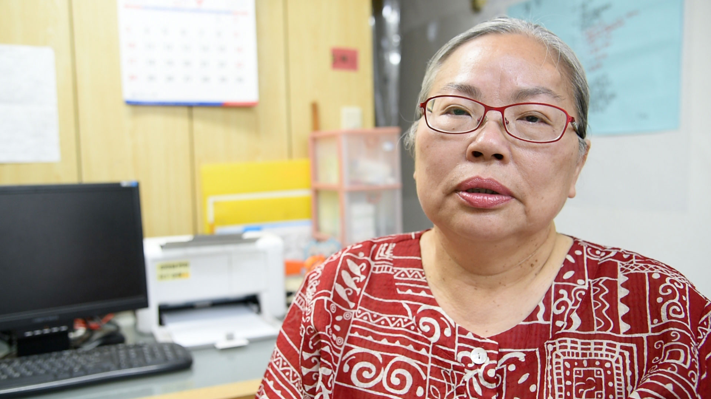

從110年開始，著手進行結束<u>北投安家</u>的程序，那一年，我們從公彩撤案、也沒有申請其他補助，所有服務、相關的行政業務，皆由2名團隊成員以志工身份去承擔。

陪伴北投社區的孩子和家庭，屈指算算，也將近17年，總不能說斷就斷、一走了之，只要服務對象仍願意和我們共學，就算是鄰里關懷，走多久就多久吧。

所以，除了結束組織得進行的法律程序，其它服務，在110年度，包括：婆婆媽媽們的個案和團體（陽明山一日遊/老梅看綠石槽/三芝芝蘭公園看海/北投龍鳳谷和天母公園散心/卡拉ok）、兒童/青少年個案和團體（英文營/週末晨跑/陽明山一日遊/二天一夜願景營），其中英文營（104年度開始）於11//1/28、週末晨跑（102年度開始）於110/2/28正式結束。另外還有，團隊（回顧檢討/自我探索）、和多位協作夥伴/贊助人餐敘。而111年度，疫情益發嚴重，暫停所有的團體服務，僅保留個案部分。依然，安排2次搭火車環島，其中一次將於7/1-7舉辦。同時預計邀請協作夥伴，陪伴孩子參加<u>2022夏日源力增能營</u>，以提升孩子的數位公民力。

以上種種，這麼多年來紮根社區，一路拼搏到現在，結束，並非因為沒有服務需求。反而，在一個愈來愈複雜、混亂的時代，服務需求更趨強烈，但也更為挑戰，過往的思維和策略，早已不足以應付現況、遑論改變的持續和深化。退場過程中，我們期待的社群對話，也一直沒有發生。至此，除了離開，別無懸念，如果無法實踐信念，就算拿到了資源，也是浪費。

叨叨唸唸這些，其實並不是有怨念不甘，但確實有些遺憾吧。大環境的逐漸崩塌，早已不是一朝兩夕的現象，但個別助人者在組織中、小團體在專業大社群中，更難找到可以實踐信念的空隙，卻也是某種現實呀。若再年輕10歲、若有新世代願意接棒，也未必不可能另闢一條蹊徑，但如今，沒有這些條件了。所幸，在波濤洶湧的浪潮中，偶而也會看到某些沈默堅持的身影若隱若現（反而科班出身的不多），祝福他/她們呀！千山獨行，倒也不必悲情，願意義無反顧，也是一種幸福。

藉由這次<u>北投安家</u>官網6/29到期，決定停止續租，一點心情，算是揮一揮手，真正地道別了吧。

> 備註：以下為110年度時，<u>北投安家</u>決定撤案、不再申請任何經費時，向補助機構提出的說明：
> 
> 服務困境：本方案經營北投社區家暴防治工作逾16年，終於決定按下熄燈號，關鍵在於諸多結構性問題，導致服務對象數量下滑，為免於造成資源浪費、也希望把心力放在安頓仍留在方案與團隊並肩作戰的服務對象，結束成為唯一選擇。
> 
> 1. 體制面：
>     1. 三級預防的落實與否：方案選擇在體制外的邊緣位置/未被納入正式服務輸送的環節，儘管三級預防是既定政策，但在執行面，資源（人力＋物力）仍傾向危機處理，對於以預防為主軸的社區工作，一般並沒有什麼實質作為。而位居三級預防中扮演轉介/轉銜關鍵角色的一般主流機構，自身面對不合理的高案量，導致在思維上的侷限、以及力有未逮的無力感，僅能勉力回應自身機構的期待去解決高案量的問題，根本無暇顧及服務對象紮根社區的需求，實質上推動服務對象回歸社區所必須進行之轉介，屈指可數。
> 
>     2. 缺乏配套措施的福利資源：公/私資源愈趨豐富和穩定，且大多為金錢/物資，而服務對象使用資源的能力，卻長期被漠視，只要符合資格，即便資源被錯誤使用/也沒有照顧到真正需要的服務對象（通常是兒少），卻也沒有對應的措施去糾正此現象。最終，服務對象想盡辦法保有福利資格/汲汲營營於獲取更多資源，脫貧脫困成為一個笑話，世代貧窮根本形同福利資源的世襲。
> 
>     3. 服務對象的社會責任：福利資源被視為權利，卻沒有要求相對的社會責任去改變和成長。儘管輔導資源也日趨完善，但在分配和運作上，往往也只是消極地提供資源，以至於造成許多服務對象為了拿到更多的實質資源/只好“應付”一下去被諮商，而非真心將其視為幫助自己提升和改變的必要手段。
> 
> 2. 家庭暴力的負面標籤：方案的服務對象長期在社區（主要是學校）被視為“壞孩子”，學校基於保護的立場，對較為貧困/但有服務需求的“好孩子”，往往不願意轉介，擔心會傷害到、或是帶壞那些“好孩子”。
>
> 3. 科技文明的侵擾（社會/文化面）：網路成癮的社會現象日趨嚴重，對新世代的學習造成難以想像的傷害。孩子對於被“剝奪”上網的時間/外出參加學習活動（且不能使用手機），往往相當排斥。
> 
> 4. 家長權威的式微vs新世代權力的高漲（家庭面）：以往家長式的威權，或許不利於親子關係，但至少大部分家長價值觀明確/也會扛起管教責任；但現代許多家長，更為重視和孩子間的友善關係，只要孩子吵鬧堅持，家長往往選擇“尊重”孩子，即便這些孩子缺乏能力/卻被賦予其沒有能力承擔的決策權。
> 
> 5. 助人專業的傳承（專業面）：隨著專業建制化，證照的普及vs助人理念/實力，以反比的趨勢發展、反差也愈來愈懸殊（事實顯示，證照並非能力的指標）。方案逐年發展建構的工作方法，需要有信念和能力的實踐者去執行，而今卻面臨無人可用的尷尬局面。“專業”高於服務對象，在社區，是蹲不下去的。